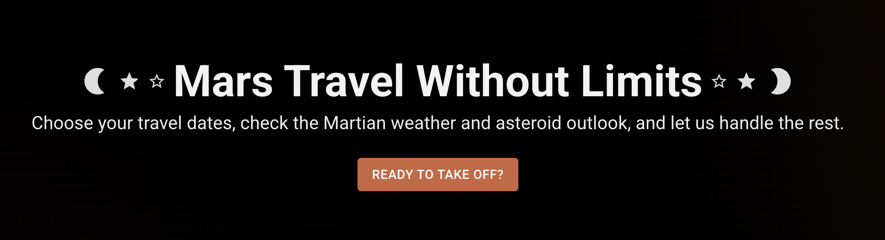
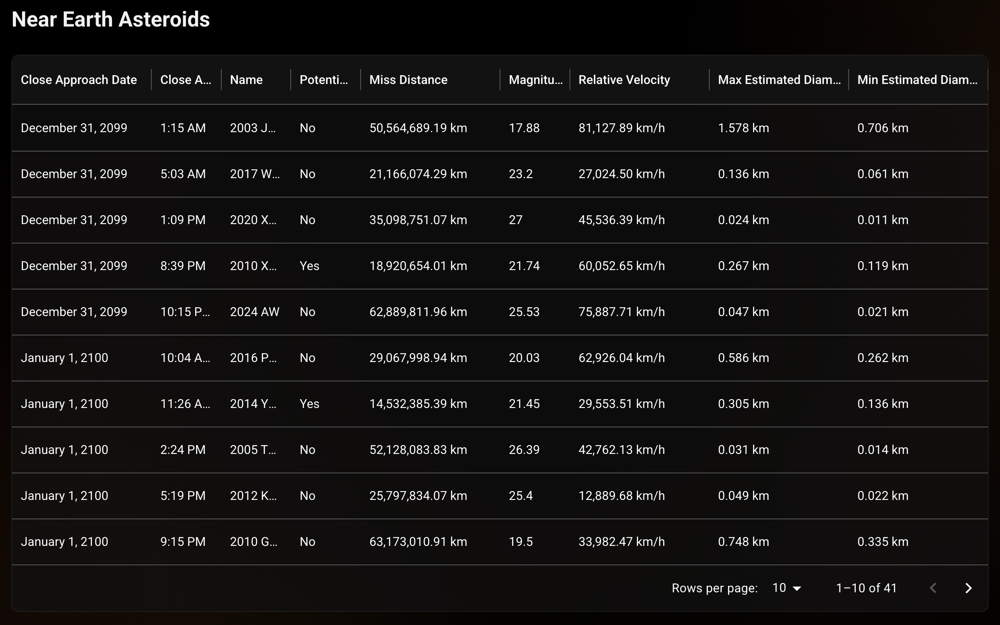
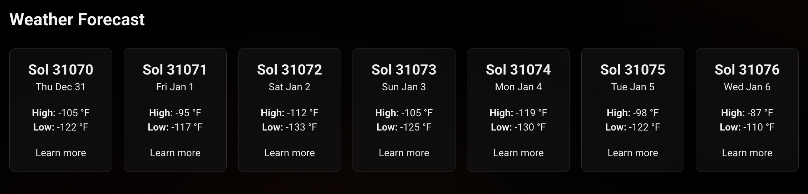
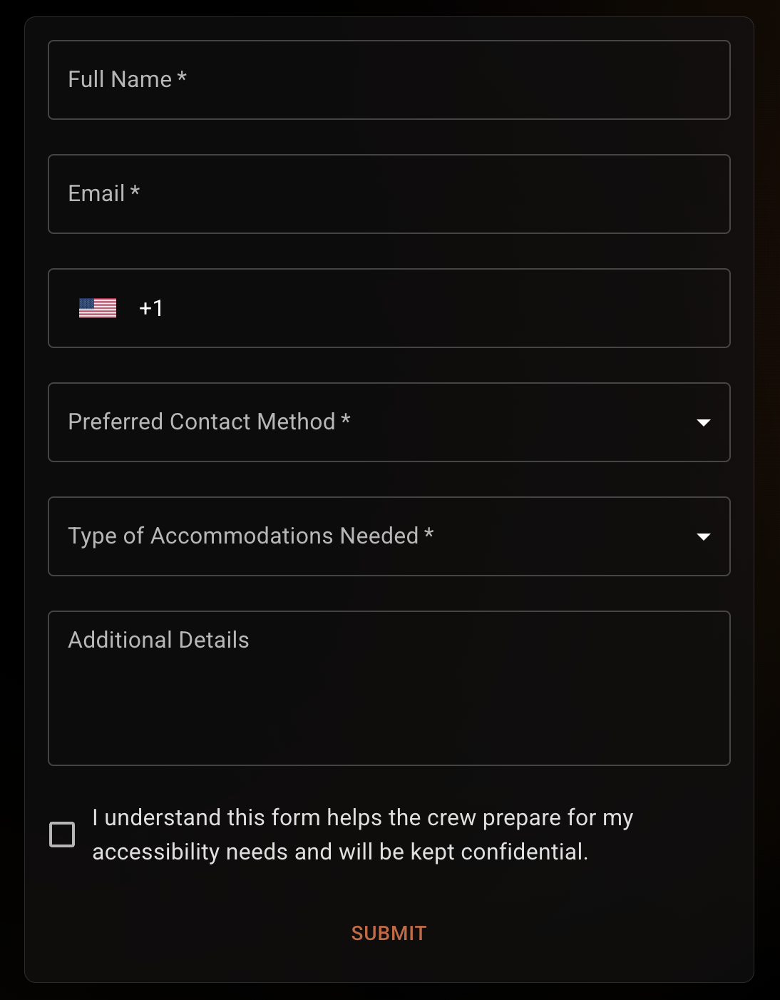

# Overview

This application is built for a fictional company called **Mars on My Mind**, set in a future where traveling to Mars is possible. The company’s mission is to make Mars travel safe, easy, equitable, and accessible, ensuring that people from all backgrounds have the opportunity to experience it if they choose.

<div align='center'>
    
</div>

# Features

This app includes several features designed to help users plan safe and informed travel to Mars:

### Martian Weather & Asteroid Forecast

Users can select a travel date and receive a **7-day forecast** that includes:

- **Martian weather** for each sol (Martian day)
- **Near-Earth asteroid data** for objects travelers might need to watch out for during launch

**Asteroid Data**

- Pulled from NASA’s [Asteroid NeoWs](https://api.nasa.gov/) (Near-Earth Object Web Service)
- The data is formatted to be easier to use to populate the table, as well as more readable for the user
- The app fetches data based on the user's selected travel date, and the API returns a full week of data by default
- Data is displayed in a **paginated and filterable table** using MUI’s `DataGrid` for a clean and responsive layout

<div align='center'>
    
</div>

**Weather Data**

- Currently **mocked** due to the retirement of NASA’s [InSight](https://science.nasa.gov/mission/insight/) Mars Weather Service in 2022
- Weather data is generated during a simulated API request and displayed in **interactive cards** showing high and low temperatures
- Clicking a card opens a **modal** with additional details for that sol’s weather
- A future enhancement will replace this with a real Mars weather data source

<div align='center'>
    
</div>

### Accessibility & Travel Support Form

The app includes an **accommodation request form** for travelers needing personalized support. Features include:

- **Custom form validation** (built from scratch)
- Use of `mui-tel-input` for **phone number validation and formatting**
- Error messaging and validation feedback

<div align='center'>
    
</div>

# Setup and Installation

Follow these steps to get the project running locally:

### 1. Clone the repository

```bash
  git clone https://github.com/hicass/cass-trial-library-assessment.git
  cd cass-trial-library-assessment
```

### 2. Install dependencies

```bash
  npm install
```

### 3. Configure environment variables

1.  Copy the example environment file:

```bash
  cp .env.example .env
```

2.  [Generate a NASA API key](https://api.nasa.gov/) (it's free).

3.  Add your API key to the `.env` file:

```env
  VITE_API_NASA_KEY="<your_nasa_api_key_here>"
```

### 4. Start the development server

```bash
  npm start
```

# Technologies

This project was built using the following technologies:

- **React** and **Vite** – for a fast, modern development environment
- **TypeScript** – for type safety and improved developer experience
- **Tailwind CSS** – to accelerate styling with utility-first classes
- **Material UI (MUI)** – as the main component library for consistent, accessible UI elements
- **TanStack Query (React Query)** – to handle data fetching, caching, and async state management
- **mui-tel-input** – for phone number input with formatting and validation

### What Was New

- **TanStack Query** was completely new to me. I enjoyed learning it and appreciated how much it simplified data fetching and state management.
- While I’ve used **MUI** before, my past experience was limited to using the date picker about a year ago. This project gave me a broader understanding of how to work with and customize more of the MUI component library.

# Approach & Design

The app follows a feature-based architecture inspired by [Bulletproof React](https://github.com/alan2207/bulletproof-react/tree/master), designed to support scalability and maintainability as the project grows.

## Project Structure

```markdown
src
├── app # App entry layer
├── components # Reusable components used throughout the app
├── features # Feature-based modules with related logic and UI
├── pages # Defines the UI for individual pages/routes
└── utils # Shared utility functions and helpers
```

## Styling and Theming

The app features a dark theme with vibrant orange accent colors, inspired by the iconic hue of Mars. This color scheme creates a sleek, modern, and futuristic aesthetic that reflects the theme of space travel while maintaining a warm, approachable feel to convey a sense of humanity. Material UI components have been customized to align with this palette, ensuring visual consistency and an engaging user experience throughout the app.

# Assumptions Made

- **Mock Weather Data Sufficiency:**
  Since the Mars weather API stopped updating in 2022, I assumed that using mocked weather data is an acceptable temporary solution for demonstrating the app’s functionality, given the fictional context of the project.
- **Stable API Data Structure:**
  I assumed that the structure of the data returned by NASA’s Asteroid NeoWs API would remain consistent over time. This assumption was necessary because the app’s data parsing and display logic rely on specific fields and formats. Any future changes in the API’s response structure could require updates to the app’s data handling code.
- **Query Date Range Validity:**
  During development, I discovered that the API accepts queries for dates far into the future—up to December 31, 2099, and still returns valid data. I assumed that this extended date range is intentional and stable, allowing users to select travel dates well beyond the current year without breaking the app. However, since this behavior is unusual for real-time data APIs, it’s possible that the API might limit or change supported query dates in the future.
- **Client-Side Pagination & Filtering:**
  I assumed that the size of the datasets returned by the NASA API is manageable enough to handle pagination and filtering on the client side without performance issues, as the API does not provide server-side pagination endpoints.
- **User Input Expectations:**
  I assumed users will enter valid input formats, supported by client-side validation, but edge cases may still exist that were not exhaustively tested.

# What I Would Change With More Time

- Add the ability to change units of measurement in the Near Earth Asteroids table.
- Further refine accommodation form validation to make it more comprehensive, robust, and user-friendly.
- Implement centralized error logging and monitoring for API failures to improve observability and facilitate faster debugging in production environments.
- Improve accommodation form onChange handlers to eliminate slight input delays experienced with the current implementation.
- Add validation to prevent excessively long input values in forms by setting maximum character limits.
- Add a feature allowing users to “book” their travel.
- Implement end-to-end, integration, and unit tests to catch and handle edge cases effectively.
- Improve the responsive styling of the asteroids table for better usability on different screen sizes.
- Simplify the mesh gradient CSS, the current file is longer than necessary given the gradient’s simplicity.
- Memoize handlers and functions to improve performance, especially as the app scales.
- Move inline style objects used in some MUI components into the theme or a dedicated styles file for better maintainability.
- Organize styles more systematically following a design system to enhance consistency and reusability.
- Add a navigation bar and footer to enhance overall app structure and user experience.
- Add more robust handling for unexpected or malformed data from the Asteroid API, particularly in the `format-near-earth-asteroid` utility.
- Reconsider the use of `mui-tel-input` as it can feel clunky; while frequently updated now, future changes could introduce issues.
- Integrate actual Mars weather data via a working API.
- Implement a CMS to enable dynamic content management.
- Explore AI integration to analyze weather and asteroid data and provide tailored travel recommendations to users.
